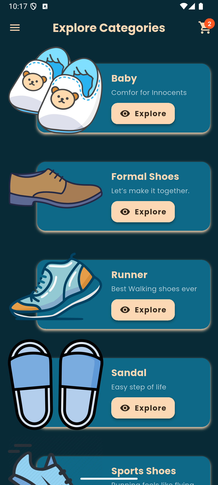
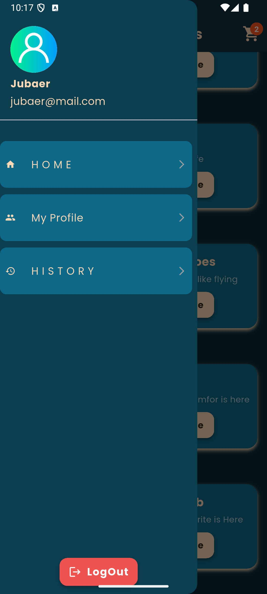
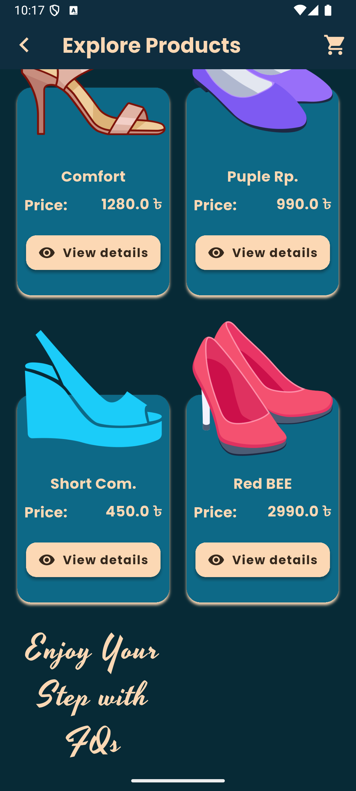
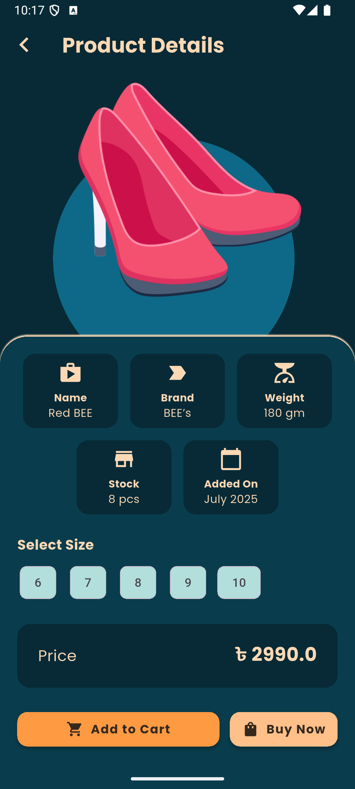
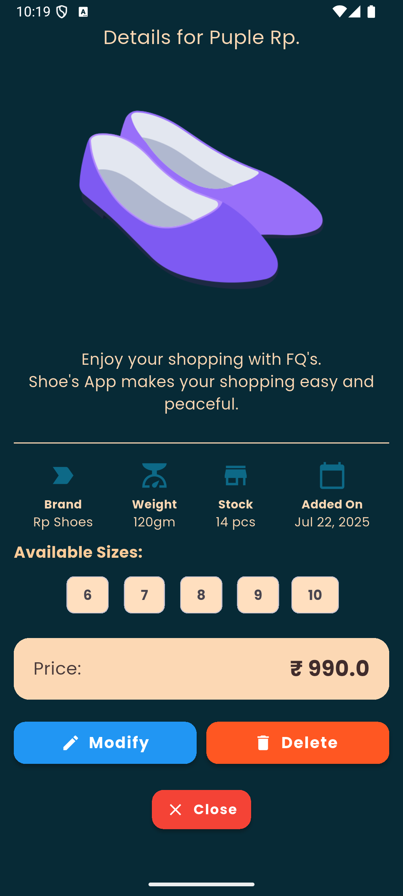
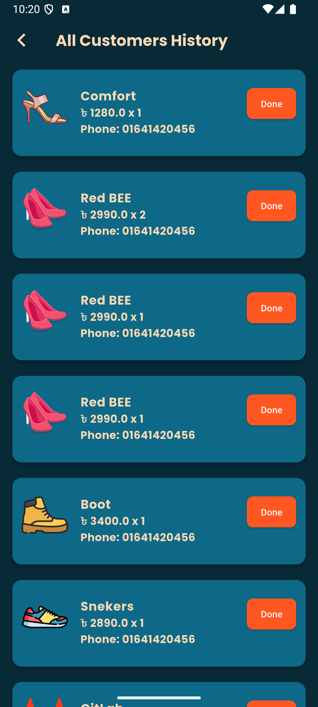
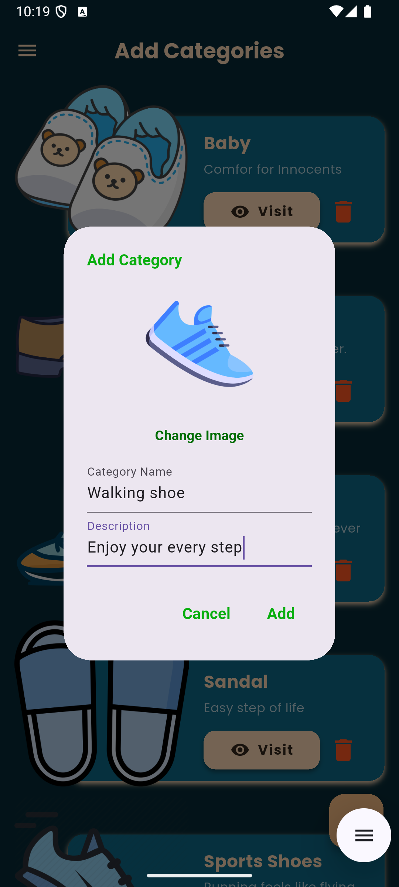
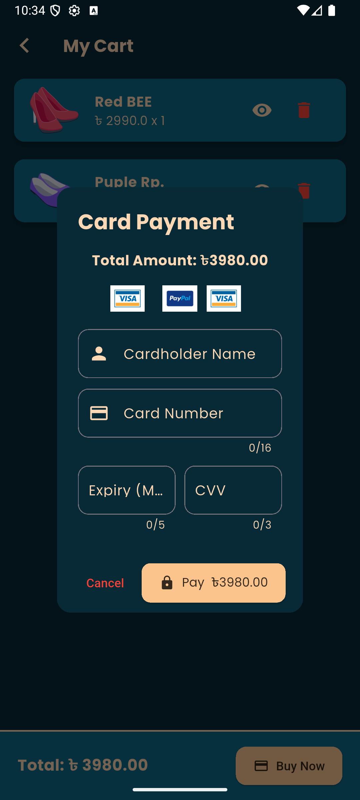
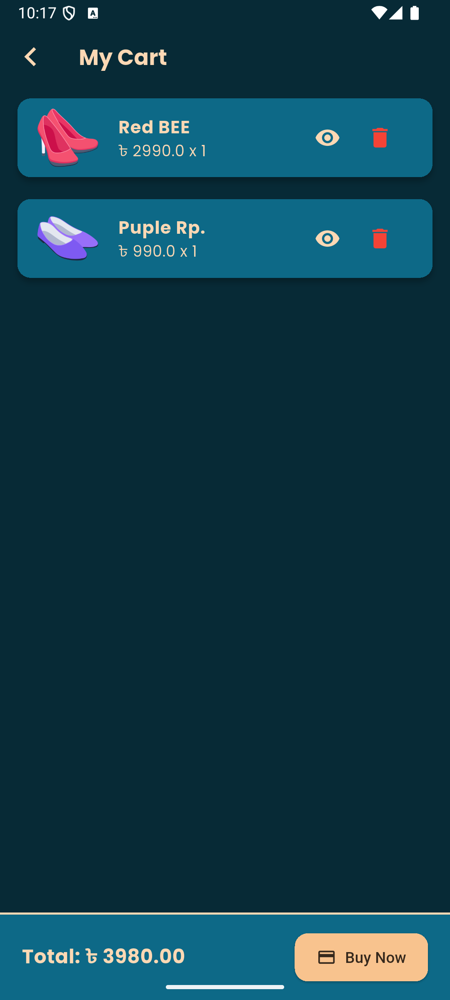

# 👟 Shoes Shop – Flutter E-Commerce App

A fully functional and beautifully designed **online shoe store** application built using **Flutter** and **Firebase**. The app allows users to browse and shop shoes with real-time updates. It includes a **Customer Panel** (shown in demo) and a separate **Admin Panel** for managing categories, products, and orders.


## 🧑‍💼 Admin Panel Features

- 🔐 Admin Authentication
- ➕ Add Product Categories
- ➕ Add Products under Categories
- ✏️ Full CRUD Operations on Products
- 📦 Manage Customer Orders


## 🛍️ Customer Panel Features

- 🔐 User Authentication (Sign up / Login)
- 🏷️ Browse Products by Category
- 📄 View Product Details
- 🛒 Add to Cart / Remove from Cart
- 📦 Place Orders
- 📜 View Order History
- 👤 User Profile
- 🔄 Real-time Database Updates

## ScreenShot

 
 
 
 
 
 
 
 
 
 
 


## 🛠️ Tech Stack

| Component                 | Technology                  |
|---------------------------|---------------------------  |
| **Framework**             | Flutter                     |
| **Programming Language**  | Dart                        |
| **Backend / DB**          | Firebase (Firestore & Auth) |
| **Image Hosting**         | Cloudinary                  |
| **State Management**      | Provider                    |
| **Storage**               | Firebase Storage (optional for assets)


---

## ⚙️ Setup Instructions

Follow the steps below to set up and run the app locally:

### 🧪 Installation

1. **Clone the repository**
   ```bash
   git clone https://github.com/JubaerFaysal/Shoes-Shop.git
   cd Shoes-Shop


